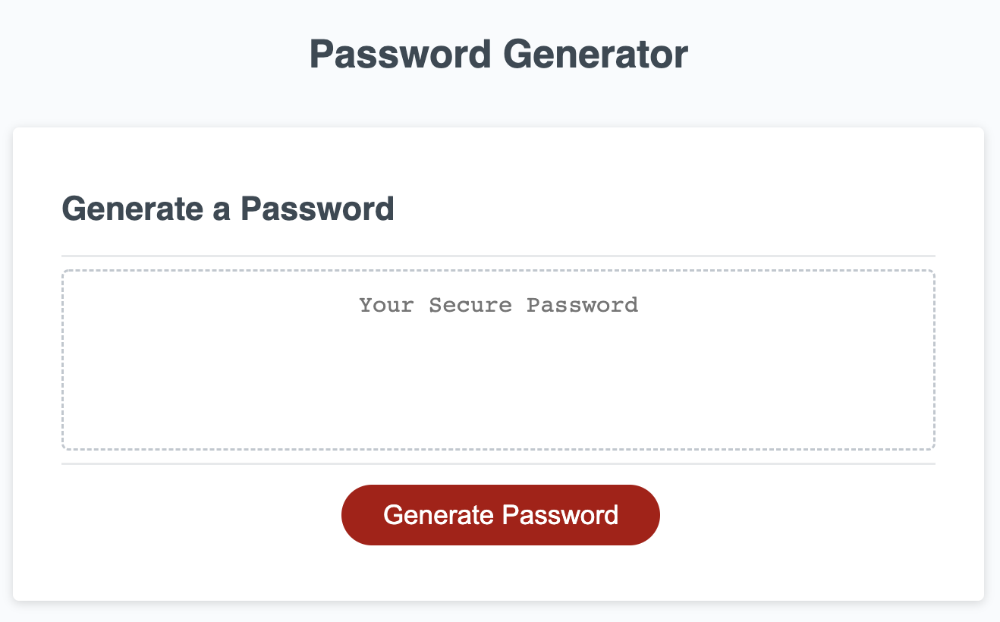
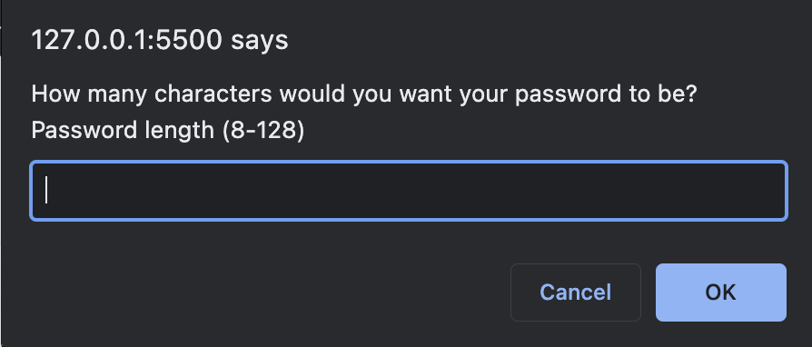
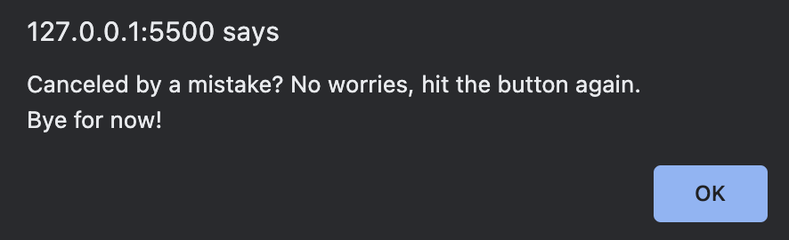
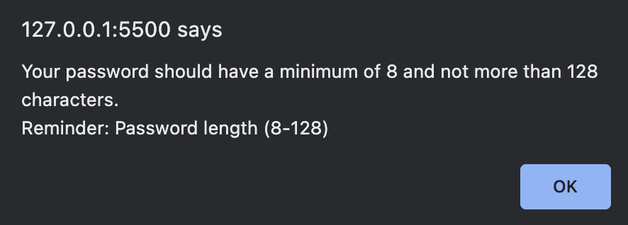
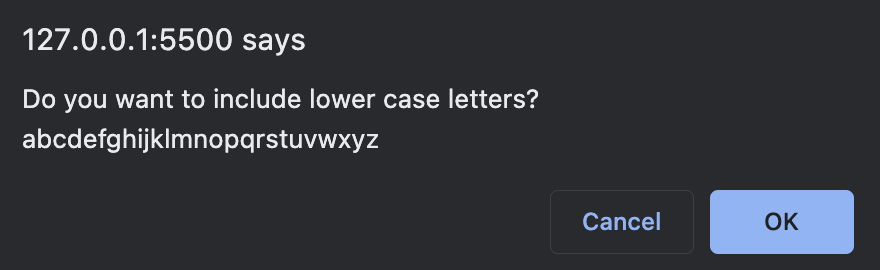
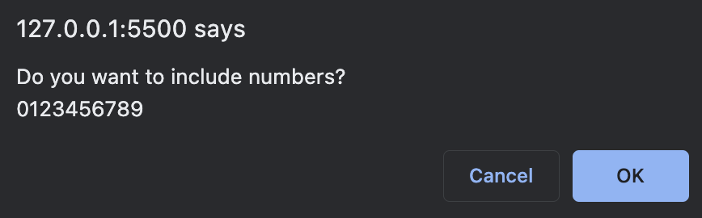
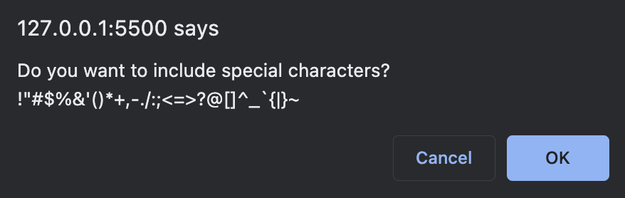
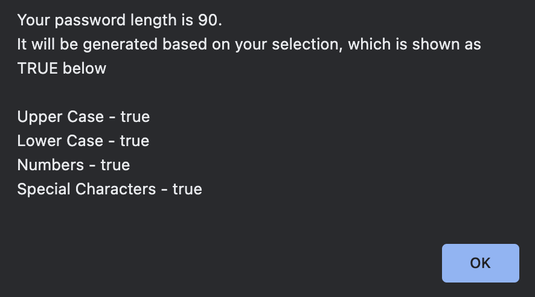
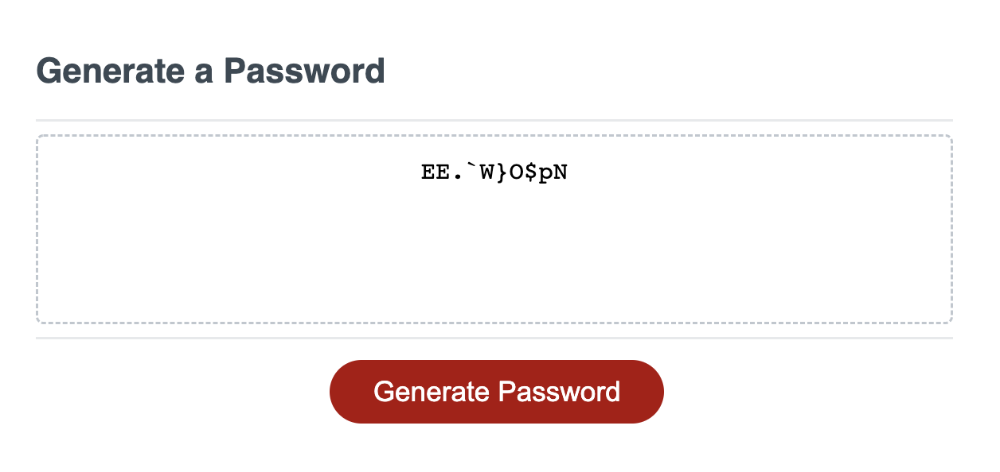

# Fernando Almeida - Password Generator.

## Purpose
A website that provides a quick way to generate a random password using Letters, Numbers and Special Characters.

## Built With
* HTML
* JS

## Website
https://flalmeida3105.github.io/pwd-generator/

## About the Website
The website presents a simple home page allowing the user to generate a password based on certain criteria

## Home page - Screenshot

## Questions Section - Screenshot

## Password Confirmation Pop-Up- Screenshot

## Generated Password - Screenshot

## Contribution
Powered by Fernando Almeida