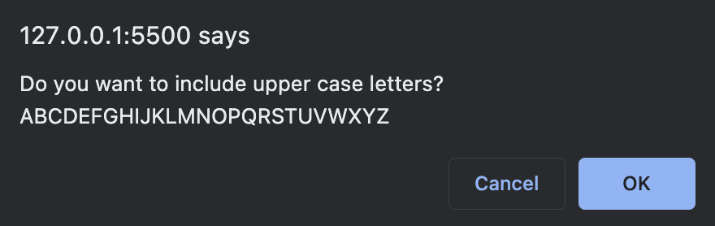

# Fernando Almeida - Password Generator.

## Purpose
A website that provides a quick way to generate a random password using Letters, Numbers and Special Characters.

## Built With
* HTML
* JS

## Website
https://flalmeida3105.github.io/pwd-generator/

## About the Website
The website presents a simple home page allowing the user to generate a password based on certain criteria

## Home page - Screenshot

## Questions Section - Screenshot

### First Pop-up

### Pop-Up that notifies the user the action was cancelled

### Pop-Up that notifies the user the minimum number of characters

### Pop-Up asking whether upper case letter should be included

### Pop-Up asking whether lower case letter should be included

### Pop-Up asking whether numbers should be included

### Pop-Up asking whether special characters should be included

### Pop-Up showing the Password Confirmation

## Generated Password - Screenshot

## Contribution
Powered by Fernando Almeida